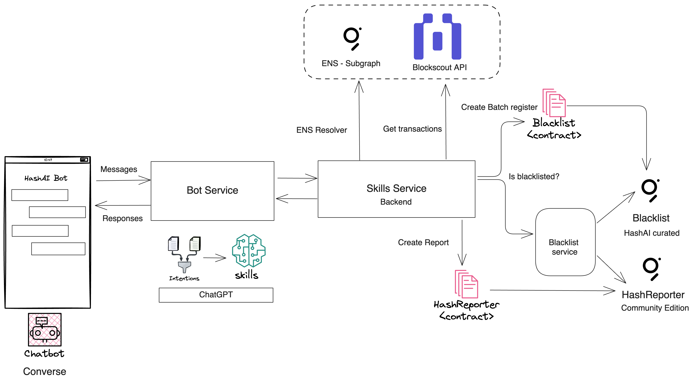

# HashAI

# Overview

Hash#AI is a chatbot-based solution that simplifies wallet transaction tracking and makes detecting connections to suspicious or blacklisted addresses easier, safer, and more user-friendly.

# Architecture

HashAI system is a chatbot application on top of Converse chat system.In order to accomplish the multiples tasks the diagram below displays the main components

### Converse Messenger

Converse is a decentralized & secure messaging app built on top of XMPT protocol. We created a [HashAI bot ](https://converse.xyz/dm/0x61C9AB5968b49905dE120C699E140044ed77Bd2E)
to interact with different tasks in our system through natural language.

### Bot service

In order to interpret the user intentions in the chat, XMTP have a MessageKit framework to abstract
it from the chatbot using ChatGPT API. We should define some steps like define, processing, create scenarios and reasoning to run a fully functional AI agent

Once the bot identifies the skills it serves as router and communicate with the backend service to retrieve the
information according to each skill.

Currently, we have 3 skills implemented:
- **Retrieve transactions from specific address**, it will go to the backend service to bring the list of transactions associated to an address or ENS.
- **Report an address**: it will go to the backend service and create a wallet report in the Polygon blockchain. 
This will store the address, and the report reason in the HashReport contract, and then it will emit an event to be indexed in a subgraph 
- **Verify if an address has been blacklisted**., this will go to the backend service and verify if the address is stored in the two blacklisted indexed graphs. 

### Skills/Backend services

The skills service intent to process all request from the Bot service and generated the expected result. It could imply data transformations

Retrieve transactions endpoint: 
- This will get all transactions from specific address through the Blockscout API. If the request is an ENS, the system will resolve the address against the ENS subgraph. 

Report an address endpoint: 
- This will create an entry in the HashReport contract, this contract intend to be where the community does a complaint.

Verify a blacklisted address:
- This endpoint will verify aginst the subgraphs if there is some report, if so, it means the address has been compromise in some kind of violation, like fishing, scam, etc...

### Contracts

Currently there are two contracts:
1. **HashReport**, this contract intend to be where the community create address complaints. Once the record is stored it will emit an event and the subgraph will index the information to be queried
2. **Blacklist**, the information stored in this contract will be collected, curated by the HashAI team, and it will preserve the same structure to the HashReport contract. 

Polygon Network: Amoy.

##  How to use it
In order to start to use the chat bot you  should follow the next steps:
1. Go to https://converse.xyz/ and download your preferred client
2. Log into the converse
3. Open the link https://converse.xyz/dm/0x61C9AB5968b49905dE120C699E140044ed77Bd2E that will redirect to the HashAI bot
4. Starting to interact with the bot, i.e: 

- Could you give me the transactions of the address 0x12345? 
- Could you verify if the address 0x12345 has been blacklisted?
- I have been scammed for someone that uses the 0x12345 address, the guy send me a link and after open it I lost my founds from my wallet 0x8888, could you report it? 

## 👨🏻‍💻 Meet the Team
- [**Cristian Chaparro**](https://github.com/cristianchaparroa)
- [**Daniel Calderón**](https://github.com/danielcdz)
- [**Robert Ramirez**](https://github.com/robertram)
- [**Julio Cesar Arango**](https://www.linkedin.com/in/julio-cesar-bog-eth/)
- [**Valentina Díaz**](https://www.linkedin.com/in/valentina-diaz-estevez/)
